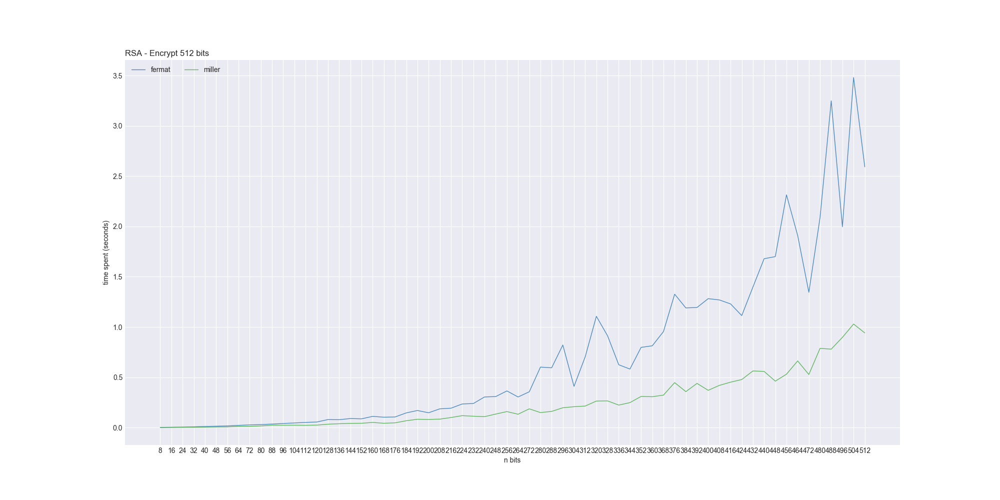
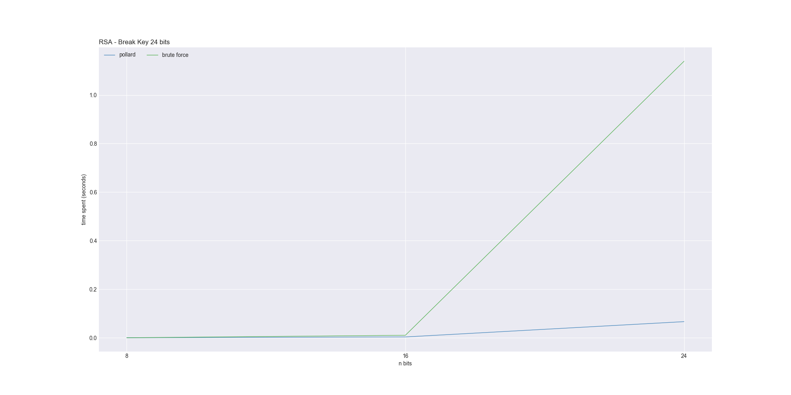

# [RSA](https://github.com/vitorebatista/rsa-article)
O RSA é um algoritmo de criptografia assimétrica amplamente utilizado que permite garantir o estabelecimento de comunicações seguras em ambientes abertos como a internet. O objetivo desse projeto é descrever conceitualmente o funcionamento do algotirmo RSA e alguns pontos de seu embasamento matemático, a implementação realizada e sua complexidade, com o foco especial na análise de performance dos processos de geração e de quebra de chave. Dentro dos resultados atingidos é possível identificar que a segurança de sistemas de criptografia está baseada primordialmente na garantia de que a fatoração de grandes chaves demanda um tempo relativamente alto, mesmo para grande capacidade computacional. Nota-se também que a utilização de testes probabilísticos como os de Fermat e Miller-Rabin, assim como heurísticas como Pollard-Rho, permitem que se tenha ganho de performance, mas sem comprometer a segurança do sistema de criptografia.

O artigo completo no formato SBC está disponível [neste link](./article/RSA.pdf).

### Instalação
Necessário ter [Pipenv](https://github.com/pypa/pipenv#installation) e executar:
```shell
$ pipenv install 
```

### Utilização

Para gerar os arquivos de chave pública, privada e os gráficos:
```shell
$ pipenv shell
$ python main.py
```
No `main.py` você pode alterar a variável `bits_limit` para visualizar na pasta `\images` o resultado da criptografia com um valor maior ou menor de bits.

Para realizar testes simples de criptografia de n bits:
```shell
$ pipenv shell
$ python test_encrypt.py
```

Para realizar testes simples de criptografia de _n_ bits:
```shell
$ pipenv shell
$ python test_break.py
```

Para verificar a assertividade das funções de teste de primalidade para os algoritmos `is_prime`, `is_prime_fermat` e `is_prime_miller`:
```shell
$ pipenv shell
$ python test_prime.py
``` 

### Exemplos de resultados:

Gráfico comparativo do tempo de criptografia para os métodos de Fermat e Miller-Rabin:


Gráfico comparativo do tempo de quebra de chave por meio de algoritmo de força bruta e Pollard Rho:



### Integrantes do projeto:

* [Felipe Nathan Welter](https://github.com/felipenwelter)
* [Vitor Emanuel Batista](https://github.com/vitorebatista)


### Referências

Fermat Primality Test:
* https://www.khanacademy.org/computing/computer-science/cryptography/random-algorithms-probability/v/fermat-primality-test-prime-adventure-part-10
* https://gist.github.com/Ayrx/5884802

Find multiplicative inverse of x (mod y)
* http://en.wikipedia.org/wiki/Modular_multiplicative_inverse

PollardRho Algorithm examples:
* https://gist.github.com/thomdixon/dd1e280681f16535fbf1
* http://marathoncode.blogspot.com/2012/08/algoritmo-pollards-rho.html
* http://code.activestate.com/recipes/577037-pollard-rho-prime-factorization/

Matplot Spaghetti plot example:
* https://python-graph-gallery.com/124-spaghetti-plot/

RSA explanations:
* https://gist.github.com/AJamesPhillips/9570158
* https://github.com/MatthewCLind/Crypto_Practice
* https://www.youtube.com/watch?v=l9okvhYxtiU
* https://github.com/sybrenstuvel/python-rsa/blob/master/rsa/prime.py
* https://www.lambda3.com.br/2012/12/entendendo-de-verdade-a-criptografia-rsa-parte-ii/
* https://security.stackexchange.com/a/37910
* https://crypto.stackexchange.com/questions/3110/impacts-of-not-using-rsa-exponent-of-65537

Euclides:
* http://nuitshell.blogspot.com/2014/07/algoritmo-estendido-de-euclides.html
* http://bdm.unb.br/bitstream/10483/7717/1/2013_BrunoCesarDiasRibeiro.pdf
* https://discuss.codechef.com/t/built-in-power-function-complexity/8901/2